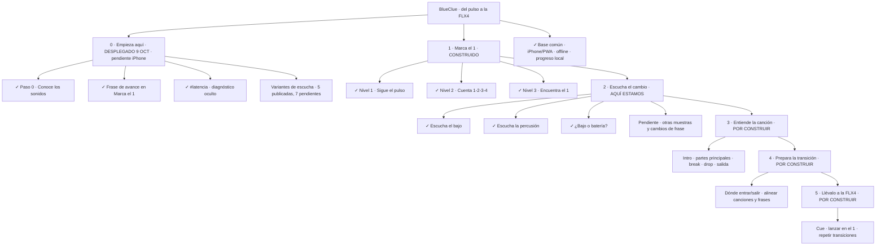

# BlueClue — mapa de construcción

Estado de referencia: **9 de octubre de 2026**.
Las casillas indican construcción, no dominio del alumno ni aprendizaje validado.

## La foto completa

Las etapas 3–5 son dirección futura, no autorización para ampliar el alcance
actual. El detalle se concretará antes de construir cada una. El análisis
automático de biblioteca queda fuera de este recorrido pedagógico inmediato.
Los conteos monótonos de 8/16/32 no vuelven al recorrido recomendado.

## Seguimiento compartido

### Navegación — un solo recorrido (rama `navegacion`, 9 octubre)

Decidido por Juan: Oído → Escucha → Ritmo, pasos «N de 7», un paso de canción
real al final de cada etapa y etapas 4–6 en gris. Detalle en
[NAVEGACION.md](NAVEGACION.md).

- [x] Portada en tres estados y lista «Tu recorrido» con estados en palabras.
- [x] Paso hecho al completarlo una vez; progreso previo recuperado.
- [x] Cabecera «Paso N de 7 · Etapa», «Inicio» y «Siguiente paso» en cada paso.
- [x] Fuera flechas y triángulos que iOS convertía en emoji.
- [ ] Juan: probarlo en el iPhone tras desplegar.

### 0. Empieza aquí — nivel 0, en `main` y desplegado (92d1ee5)

- [x] Portada con «Empieza aquí» / «Seguir donde lo dejé» y el mapa debajo.
- [x] Paso 0 · Conoce los sonidos: bombo, caja, charles y bajo; «¿Cuál suena?».
- [x] Teach / Assist / Train con su frase; sin «BPM» ni «vista ampliada».
- [x] Frase de avance tras cada ronda (3 buenas de 5, 80 %).
- [x] `#latencia`: mide, no corrige.
- [x] Doce variantes de escucha generadas; cinco aceptadas y publicadas.
- [ ] Juan: iPhone físico, tres medidas de latencia, escuchar las siete variantes restantes.
- [ ] Juan reconoce lo aprendido en una muestra no practicada.

Detalle: [EMPIEZA-AQUI.md](EMPIEZA-AQUI.md).

### 1. Marca el 1 — V0.1

- [x] Nivel 1: sigue el pulso.
- [x] Nivel 2: cuenta 1-2-3-4.
- [x] Nivel 3: encuentra el 1.
- [x] Cinco pistas, velocidades y Teach / Assist / Train.
- [x] Feedback, replay y Challenge con récords.

### 2. Escucha el cambio — V0.2, en desarrollo

- [x] Escucha el bajo.
- [x] Escucha la percusión.
- [x] ¿Bajo o batería?
- [ ] Otras muestras, mismo oído: próximo incremento propuesto.
- [ ] Reconocer cambios de frase.

Validación pendiente: reconocer sin guía y sin memorizar los tiempos de entrada.
Aceptar la claridad de una muestra no demuestra por sí solo aprendizaje.

### 3. Entiende la canción — V0.3, futuro

- [ ] Intro y salida.
- [ ] Partes principales, break y drop.
- [ ] Mapa visual de la canción.

### 4. Prepara la transición — V0.4, futuro

- [ ] Elegir dónde entrar y salir.
- [ ] Alinear dos canciones y sus frases.
- [ ] Práctica guiada de mezcla y feedback.

### 5. Llévalo a la FLX4 — V0.5, futuro

- [ ] Preparar cue y lanzar en el 1.
- [ ] Repetir transiciones en la controladora.

### Base común — la mochila

- [x] iPhone, PWA y modo avión.
- [x] Menú claro y progreso local.

## Mapa interactivo

[Descargar la versión interactiva](visuals/blueclue-map.html) y abrirla en el
navegador. GitHub muestra el código HTML, no ejecuta las casillas.

Las marcas interactivas son personales, se guardan cuando el navegador permite
almacenamiento y **no actualizan GitHub, Notion ni la app**. Para compartir avances,
editar las casillas de este documento y guardar el cambio en Git. Al cambiar el
estado de construcción, actualizar también la
[fuente del mapa](visuals/blueclue-map.source.html) y regenerar su versión autónoma.

El mapa se exporta con el generador `scripts/render.py` del skill Visualize:
entrada `docs/visuals/blueclue-map.source.html`, salida
`docs/visuals/blueclue-map.html` (usar `--force` al regenerar).
El archivo exportado ya incluye la presentación y no necesita el generador para abrirse.

Alcances completos: [V0.1](V0.1.md), [V0.2](V0.2.md) y [roadmap](ROADMAP.md).
